# Chapter.2  Information Visualization data flow

## 이번 장에서 배우게 될 내용
- 다양한 형태의 데이터 불러오기
- D3 scales에 대해 배워보기
- Data 전처리/ 분석/ 시각화의 과정
- Data에 기반하여 적합한 시각적 특성을 가미한 그래픽 생성
- Data graphics 바꾸기 및 animating

---
## 2.1  Working with data

이번 장에서 다루게 될 데이터는 크게 두 가지입니다.
1. 지역의 위치 및 인구데이터
2. 누가 보내고 반응했는지에 관한 가짜 트위터 데이터

위 데이터로 우리는 아래의 과정을 진행할 것입니다.

</img>

---

### 2.1.1 Loading Data

우리는 1장에서 말한 대로 어떠한 standardized way로 format된 데이터를 받게 될 것입니다. 이러한 데이터는 어찌됐건 XML, CSV, JSON 포맷 중 하나로 받게 될 것입니다. 이 파일 형식들의 특성은 1장에서 배웠으니 생략합니다. 위의 세 형식의 차이점 중 하나는 data를 어떻게 modeling하는지에 대한 차이입니다. XML, JSON 형식은 데이터를 nested한 형태로 보관합니다. 하지만 csv는 여러분이 아시는 바와 마찬가지로 그렇지 않습니다.

또 다른 차이점은 d3에서 세 파일을 읽어들이는 방식입니다. d3.csv()와 d3.json()을 이용하여 데이터를 읽는 경우, json 객체의 array가 생성됩니다. 하지만 d3.xml()은 XML document를 생성하며 이것은 위 두개와는 다른 방식으로 사용되어야 합니다.

위 세 개의 함수 이외에도 d3.html(), d3.text()를 이용하여 데이터를 불러올 수 있다고 합니다.

d3.csv()와 d3.json()의 사용 예시는 아래와 같습니다.
~~~javascript
> d3.csv("cities.csv",(error, data) => {console.log(error, data)});
~~~
이때 콘솔창에서 에러를 딱히 보고싶지 않다면 아래와 같이 하면 됩니다.
~~~javascript
> d3.csv("cities.csv",d => {console.log(d)});
~~~
이때 주의할 점은 항상 데이터를 위처럼 XHR방식으로 불러오지 않아도 된다는 것입니다. 앞으로도 절대 바뀌지 않을 데이터의 경우에는 굳이 지속적으로 이렇게 불러오는 것보다는 아예 script 태그 안에 포함시키는 것이 나을 수도 있습니다.(물론 남이 봐도 상관없는 데이터의 경우에만 해당됩니다)

위의 예시에서는 데이터를 global variable "d"에 담은 형태입니다. 실제 현업에서는 이렇게 global variable을 이용하는게 그닥 선호되지는 않습니다. 하지만 우리는 배우는 입장이므로 대부분의 예시에서 위와 같은 방식으로 진행할 것입니다.

그럼 책에서 준 데이터를 아래 방식으로 불러왔다고 생각해봅시다.
~~~javascript
> d3.csv("cities.csv",data => {console.log(data)});
> d3.json("tweets.json",data => {console.log(data)});
~~~
이 때, d3.csv()는 바로 array 객체를 뱉어내지만, d3.json()은 key/value 의 짝을 뱉어냅니다(python의 dictionary 타입을 생각해보세요). 따라서 csv의 경우에는 data variable을 통해 바로 array에 접근 가능하지만, tweeter 데이터의 경우 data.tweets 라는 키를 입력해야 array에 접근할 수 있습니다. 즉, tweets라는 키가 array value에 대응되므로 이것을 이용해야 우리가 진짜 원하는 array에 접근할 수 있습니다.

그럼 이제 데이터를 불러올 때의 주의사항에 대해 말씀드리겠습니다. 데이터를 XHR 방식으로 불러올 때에는 생각보다 시간이 많이 걸립니다. 따라서 만약 우리가 데이터를 불러왔다는 가정하에 돌아가는 함수가 데이터를 불러오기도 전에 먼저 실행된다면 client에게 오류 메시지가 뜨겠죠. 이것을 해결하기 위해서는 다양한 방식이 있습니다. 그 중 크게 두 가지를 알아봅시다.
1. **d3.csv("somefiles.csv", function(data){doSomethingWithData(data)});**

    위와 같은 방식으로 data loading function 안에 내가 실행하고픈 funcition을 nested 방식으로 실행하기
    
    
\2. queue.js 를 이용하여 일이 순서대로 진행될 수 있도록 하기(뒤에서 배움)

---

### 2.1.2 Formatting data

데이터를 불러온 다음에 우리는 다양한 메소드를 이용하여 데이터를 크기, 색깔, 위치 등에 대응시켜 표현할 수 있게 만듭니다. 이 때, 첫번째 데이터인 지도 데이터의 경우 전통적인(쉽게 떠올릴 수 있는) 방법이 있으나, 두 번째 트위터 데이터는 쉽사리 떠오르지 않습니다. 따라서 우리는 이번 절에서 다양한 데이터 type에 대해 배웁니다. 크게 정리해 보면 아래와 같은 데이터 형식이 있습니다.
- quantitative
- categorical
- geometric
- temporal
- topological
- raw

우리가 어떠한 방식으로 데이터를 보여주고싶은가에 따라서 데이터를 어떻게 formatting할지가 달라지게 됩니다.

</img>

#### 데이터 타입에 대해 알아봅시다
1. Quantitative
    - quantitative, numeric 데이터는 가장 흔한 타입입니다.. 흔히 size, position, color를 이용하여 시각화합니다.
    - 우리 데이터의 경우 1번의 population은 이미 quantitative지만, tweeter 데이터는 그렇지 않습니다. 따라서 이 경우 우리가 전처리를 해줘야 합니다.

2. Categorical
    - 국가, 성별과 같은 법주형 데이터! 주로 형태와 색상으로 표현합니다. 트위터 데이터의 경우 user라는 카테고리가 있고, 유저마다 색상을 다르게 주는 방식으로 시각화할 수 있습니다.
    
3. Topological
    - 두 데이터 간의 관계를 표현하는 데이터입니다.
    - 예를 들어 두 사람간의 족보 관계, 두 상점 간의 거리가 있습니다.
    - 1번 데이터의 경우 도시간의 거리를 우리가 추가하여 topological data를 만들 수 있습니다.
    - 2번 데이터의 경우 favorites 와 retweets array를 이용하여 topological data 시각화를 할 수 있습니다.
    
4. Geometric
    - 주로 지리적 데이터의 경계, 길 등에 사용됩니다.
    - 예를 들어 국가, 도시, 길 etc.
    - 당연히 형태와 크기를 그리는 데에 가장 많이 사용되지만, 드물게 크기를 계산하여 quantitative 데이터로 연결시키는 경우도 있습니다.

5. Temporal
    - 날짜와 시간
    - ISO 8601 포맷이 가장 유명하다고 합니다.(Javascript에서 이 포맷을 이용합니다.)
    - 걍 string으로 쓰지말고 datetime 형식으로 변환해서 사용하는 게 좋다고합니다.
    - tweeter 데이터에서 datetime은 RFC 2822 포맷으로 제공되었다고 합니다.(ISO 8601 형식으로 쉽게 변환 가능)

6. Raw
    - 흔히들 생각하는  비정형 데이터
    - 텍스트, 혹은 이미지 형식입니다.
    - 각각의 방식에 맞는 어떠한 방식을 이용하여 시각화에 적절한 방식으로 변환될 수 있습니다.
    - 변환되지 않은 경우에는 label이나 설명 등에 이용할 수 있겠습니다(다른 시각화에 도움을 주는 정도)
    
---

### 2.1.3 Further modifying data

데이터를 변환하는 다양한 방식에 대해 이야기 합니다.
    - casting
    - normalizing
    - binning
    - nesting

#### 1. casting
데이터의 형식을 다른 데이터 형식으로 바꾸는 것입니다. 예를 들어 우리가 데이터를 부르면 int나 datetime인데도 string으로 간단하게 되어있는 경우가 많습니다. 이 경우 우리가 원하는 데이터 형식으로 바꾸어주어야하고 그것을 casting이라고 부릅니다. 

- Javascript에서 데이터 형식 바꾸기
    - parseInt("77"); +"77";
        - int  형식으로 바꿈(강제 형 변환도 가능)
    - parseFloat("3.14"); +"3.14"
        - float 형식으로 바꿈(강제 형 변환도 가능)
    - Date.parse("Sun, 22, Dec 2013 08:00:00 GMT");
        - ISO 8601 혹은 RFC 2822 형식의 string을 date datatype으로 바꿔줌
    - text = "alpha,beta,gamma"; text.split(",")
        - casting이라고는 할 수 없지만 데이터 타입을 바꾸는 예시
        
#### 2. Scales and Scaling
수치형 데이터가 주어지면 그걸 그대로 사용하는 경우는 거의 없습니다. 값이 엄청 큰 특이값이 있다고 생각해보세요. 그럼 예를 들어 도형의 크기와 수치를 대응시켰을 때 하나가 너무 커서 다른 것들이 잘 안보이겠죠. 따라서 우리는 정규화를 해서 값의 범위를 맞춰주어야 합니다. 아래에서 d3의 정규화법을 알아보죠!

~~~javascript
> var newRamp = d3.scaleLinear().domain([500000, 13000000]).range([0,500]);

> newRamp(1000000);     //returns 20

> newRamp(9000000);     //returns 340

> newRamp.invert(313);  //returns 8325000, 역함수
~~~

</img>

숫자의 범위를 색과 대응시키고 싶다면 아래와 같이 하면 됩니다.

~~~javascript
> var newRamp = d3.scaleLinear().domain([500000, 13000000]).range(['blue','red']);
> newRamp(1000000);    //returns '#OaOOf5"
> newRamp(9000000);    //returns '#ad0052'
> newRamp.invert('#ad0052')  //invert 함수는  numerical range로 변환할 때만 가능. 따라서 에러 뜸
~~~

</img>

아래와 같은 다른 정규화 함수도 있습니다!
- d3.scaleLog()
- d3.scalePow()
- d3.scaleOrdinal()
- d3.scaleTime()   ->  datetime을 정규화할 때 사용

#### 3. Binning: Categorizing Data
"bin"이 무엇인가요? 쓰레기통이죠! 맞습니다, binning은 데이터를 쓰레기통에 담는 것입니다. 하지만 그냥 담는 게 아니라 여러 개의 쓰레기통에 크기 순으로 구분해서 나눠담는 것이지요. 바로 코드를 보죠!

~~~javascript
> var sampleArray = [423, 124, 66, 424, 58, 10, 900, 44, 1];
> var qScale = d3.scaleQuantile().domain(sampleArray).range([0,1,2]);
> qScale(423);  // returns 2
> qScale(20);  // returns 0
> qSclae(10000);  // returns 2
~~~

위에서 d3.scaleQuantile()은 domain에 속한 데이터를 크기순으로 정렬해서 데이터를 똑같은 길이로 잘라줍니다. 그 뒤 range에 정의된 그룹으로 데이터를 나눠 담아줍니다. domain의 작은 값은 range의 작은 값과 자동으로 대응됩니다. 따라서 아마도 range([2,1,0])으로 해도 같은 결과가 나왔을 것으로 예상됩니다.

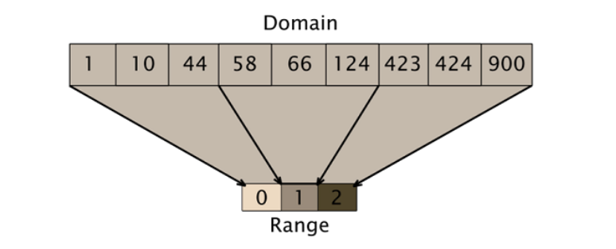

binning은 아래처럼 텍스트 혹은 색상 등에 대응시킬 수도 있습니다.

~~~javascript
> var sampleArray = [423, 124, 66, 424, 58, 10, 900, 44, 1];
> var qScaleName = d3.scaleQuantile().domain(sampleArray).range(["small","medium","large"]);
> qScale(68);  --> returns "medium"
> qScale(20);  --> returns "small"
> qSclae(10000);  --> returns "large"
~~~

#### Nesting
어떠한 hierarchical 데이터를 그 관계를 무시한 채로 해석하면 정보의 손실입니다. 우리는 정보의 손실을 싫어합니다. 따라서 이러한 관계를 나타낼 수 있도록 데이터를 수정하는 것을 **nesting**이라고 합니다. nesting의 기본 아이디어는 데이터끼리 어떠한 특성을 공유한다면 그것을 이용하여 categorizing하고, 또 다른 것을 이용하여 subcategorizing 하는 과정을 반복하는 것입니다. 우리의 두 번째 데이터인 tweeter를 nesting 해볼까요?!

위는 user 라는 특성을 이용하여 nesting한 예시입니다. 위와 같은 결과가 나오도록 하는 코드를 짜보도록 하겠습니다.
~~~javascript
> d3.json("tweets.json",data=> {
>     var tweetData = data.tweets;
>     var nestedTweets = d3.nest()
>         .key(d => d.user)
>         .entries(tweetData);
> });
~~~

### 2.1.4 Measuring data

우리는 데이터를 불러오면 데이터를 제대로 시각화하기 위해 평균, 최대/최소값을 알고 싶어합니다. 이번 절에서는 해당 방법을 배웁니다.

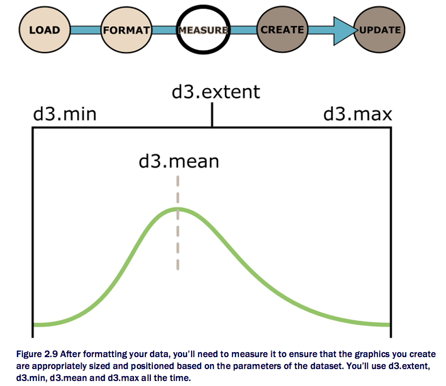

1. 단순 어레이를 받은 경우
~~~javascript
> var testArray = [88,10000,1,75,12,35];
>    d3.min(testArray, el => el);  //1
>    d3.max(testArray, el => el);  //10000
>    d3.mean(testArray, el => el);  //1701.83333333
~~~

2. 복잡한 JSON object array를 받은 경우
~~~javascript
> d3.csv("cities.csv", data => {
>      d3.min(data, el => +el.population);  //500000
>      d3.max(testArray, el => +el.population);  //1300000
>      d3.mean(testArray, el => +el.population);  //6856250
> });
~~~

cities.csv에는 많은 컬럼이 존재하며, 해당 데이터를 받는 경우(el) population에 대해서만 통계량을 알려달라(+el.population)는 의미입니다.

위처럼 최소값 최대값을 각각 따로 계산하기 귀찮다면
~~~javascript
> d3.extent(data, el => el.population); //[500000, 1300000]
~~~
을 사용하셔도 됩니다.

---

## 2.2 Data-binding

Data binding이 시각화의 단계 중 create 단계에서 어떻게 쓰이는지 알아봅시다

### 2.2.1 Selections and binding

우리는 D3를 이용하여 웹 페이지의 구조와 모양을 바꾸기 위해 **selection**을 이용합니다. 우리가 무언가를 select할 경우, 데이터와 그에 연관된 DOM의 어떠한 성분도 select하는 것입니다. 이를 이용하여 새로운 성분(element)를 생성하거나, 없앨 수도 있습니다. Select하는 법은 다음과 같습니다.
~~~javascript
> d3.select( )
~~~

이제 우리는 전세계의 도시들에 대한 데이터인 cities.csv 데이터를 이용하여 실습해보겠습니다. 우리가 먼저 할 일은 데이터를 로드하고, data visualization function을 callback에서 실행하여 새로운 **div** element를 만들어보는 일입니다. 아래는 코드 설명이 중요하여 그대로 가져왔습니다.

여기서 d3문법의 특이한 부분을 확인할 수 있습니다. 존재하지 않는 태그와 클래스를 선택한 후에, 해당 클래스에 데이터를 붙이고(binding) 마지막에 존재하지 않던 태그와 클래스를 생성합니다. 뒤에서 좀더 자세히 알아봅시다.

위에서 우리가 쓴 d3 코드를 실행하면 벌어지는 일입니다. div 태그가 cities.csv에 포함된 도시 갯수만큼 생성되었습니다.

그럼 이제 위에 사용된 d3 method 하나하나의 역할을 알아보겠습니다.

- **.selectAll()**
    - d3.select() 혹은 d3.selectAll()로 사용됩니다.
    - css identifier(css selector로 생각해도 무방)와 함께 사용되어 DOM의 일부분을 선택합니다.
    - 위의 예시처럼 존재하지 않는 것을 select(empty selection) 하기도 하는데, 이는 **.enter()**를 이용하여 새로운 page element를 생성하기 위함입니다.
    - selection을 다시 selection 하여 특정 DOM 성분의 생성과 수정 행동 그 자체를 선택할 수도 있습니다.
    - subselection은 parent를 자동 생성하지 않기 때문에, parent가 이미 존재하던지, **.append()**를 이용하여 parent를 새로 생성해야 합니다.

- **.data()**
    - 위의 코드에서 우리는 데이터 array를 DOM 성분에 대응시켰습니다. 즉, 하나의 도시가 div.cities에 각각 들어갔습니다.
    - 이때 각 DOM element에 대응되는 data는 'data'라는 attribute에 저장되어 있습니다.
    - 따라서 아래와 같은 방식으로 각 DOM element에 대응되는 데이터에 접근할 수 있습니다.
    
    
   

- **.enter() & .exit()**
    - 우리가 data를 selection에 binding할 때, data value에 대응되는 DOM element의 갯수가 동일할 수도 있지만, 그렇지 않을 수도 있습니다.
    - select된 DOM element가 data value의 갯수보다 적다면, **.enter()**를 이용하여 대응되는 DOM element가 없는 data value 각각에 대응되는 element를 만들어줄 수 있습니다.
    - 위의 예시에서는 city가 총 여덟 개 있었고, div.cities에 대응되는 DOM element가 없었기 때문에, enter()가 여덟 번 실행되고 여덟개의 div.cities가 만들어졌습니다.
    - 만약 data value보다 DOM element 갯수가 더 많다면, **.exit()**을 이용하면 됩니다.
    - 만약 갯수가 정확히 일치한다면, .enter()와 .exit() 둘 다 발현되지 않습니다.
    - 갯수가 대응되는지 여부를 정확히 모른다면, .enter()와 .exit()을 둘 다 써도 되는 것 같습니다(작가가 애매하게 말하고 직접 예시를 들지는 않았어요)
  

- **.append() & insert()**
    - 대부분의 경우 우리에겐 data value가 DOM element보다 많기 때문에 새로운 element를 만들어야합니다. 이때 이용하는 것이 **.append()**입니다.
    - .append()는 element를 추가할 수 있게 해줍니다. 위의 예시에서는 가장 단순하게 **div** element를 추가했지만, 뒤에선  SVG, table 등을 append 할 것입니다.
    - **.insert()**는 append의 사촌 같은 존재이며, 전체 document의 어느 위치에 element를 추가할 것인지를 정의해줍니다.
    - append와 insert를 data가 아니라 selection 그 자체에 대해서도 적용할 수 있는데, 이 경우엔 딱 하나의 DOM element만 추가됩니다.

- **.attr()**
    - 위에서 설명된 method들은 새로 생성되는 DOM element에 적용된다는 점에 주의하세요.'
    - 우리는 select 할 때 **div.cities**를 empty selection 했다는 점에서 이러한 DOM element를 생성할 것이라는 걸 알고있습니다.
    - 하지만 그럼에도 .enter() 후에 이어지는 append와 attr에서는 다시 한 번 우리가 무엇을 생성하길 원하는지를 명시해야합니다.
    - 위의 예시에서는 append에서 추가한 div element에 "class = cities"라는 특성을 추가해달라는 함수를 짰습니다.

- **.html()**
    - content를 세팅할 때 사용합니다.
    - 뒤에서 더 자세히 배우겠지만, 위에서는 data의 label을 content로 사용하라는 명령어를 사용했습니다.

---

### 2.2.2 Accessing data with inline functions

앞선 cities.csv의 selection 예제에서 우리는 데이터의 도시 이름 갯수만큼 DOM element를 생성하였습니다. 이것은 우리가 selection 과정에서 inline anonymous function을 이용하여 자동으로 받아지는 두 개의 변수인 data value와 array에서의 index 중에서 data value를 택했기 때문입니다(d => d). 우리가 했듯이 대부분의 예시에선 data는 d로, index는 i로 받아들이지만 이러한 notation을 얼마든지 바꿔도 무관합니다.

//개인적인 추가 : d3 뒤에 method 형식으로 붙는 모든 function을 inline function이라고 하는 것 같습니다. 그래서 어떤 method에서도 (d,i)에 접근해서 그것을 이용한 전체 method chain을 구성할 수 있는 것 같아요.

이러한 과정은 매우 단순한 데이터를 이용하여 간단한 시각화를 해봄으로써 직접 확인해볼 수 있습니다. Chapter_1에서 배운 **d3ia.html**을 예시로 알아봅시다.

~~~javascript
> d3.select("svg")
>     .selectAll("rect")
>     .data([15, 50, 22, 8, 100, 10])
>     .enter()
>     .append("rect")
>     .attr("width", 10)
>     .attr("height", d => d);
~~~

위의 코드에서 우리는 간단한 array를 selection과 bind 하였습니다. 마지막 부분에서 rectangle의 높이를 data 값 자체로 할당한 것을 확인할 수 있습니다. 또한 위에서 cities.csv의 예시와는 달리 .html()에서 d.label을 사용하지 않은 것을 확인할 수 있는데, 이는 받아들이는 데이터의 구조가 위와 달리 단순한 숫자의 나열이기 때문입니다. 따라서 d=>d로 그대로 데이터를 받아옵니다. 위 코드의 결과는 아래와 같습니다. 별도의 설정을 하지 않아서 디폴트 색상인 검은색으로 표시되었고, 각 그룹마다 default x,y 좌표가 사용되었기 때문에 총 그려져야 하는 6개의 사각형이 완전히 겹쳐져서, 각 사각형을 구분할 수 없게 되었습니다.

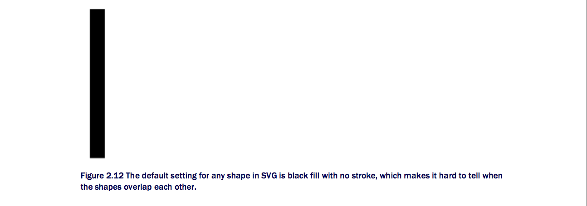

위의 그림을 opacity만 조정해보겠습니다. figure 2.13에서 확인할 수 있듯이, 각자 따로 그려져야하는 사각형이 서로 겹쳐져있는 상태입니다. 이것도 나름대로 이쁘긴하지만, 바라던 바는 아닙니다.

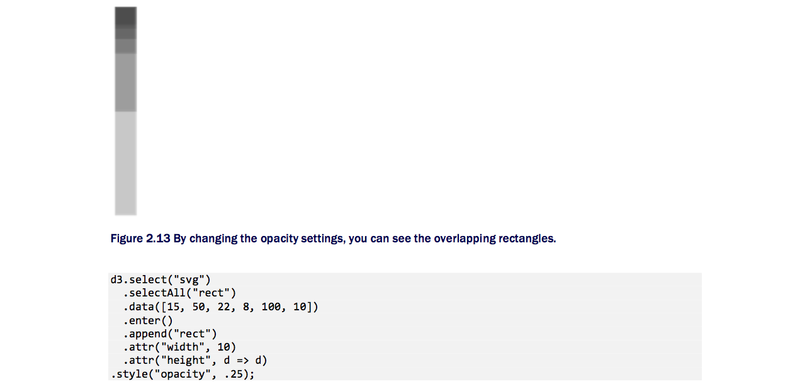 

이제 우리가 목표하던 바를 이루기 위해 inline function에서 받을 수 있는 두 개의 변수 (d,i) 중에서 i를 이용해보겠습니다. 데이터가 array에서 몇 번째 index인지를 우리가 미리 설정해둔 width(10px)을 이용하여 사각형을 한 칸씩 옆으로 이동하겠습니다.

~~~javascript
> d3.select("svg")
>     .selectAll("rect")
>     .data([15, 50, 22, 8, 100, 10])
>     .enter()
>     .append("rect")
>     .attr("width", 10)
>     .attr("height", d => d)
>     .style("opacity", .25)
>     .attr("x", (d,i) => i * 10);

~~~

결과는 아래 **figure 2.14**와 같습니다. d3 문법에서 SVG의 x,y 좌표는 좌측 상단을 (0,0)으로 생각하며 해당 위치에서 아래 방향으로 그리기 때문에 위에 매달린 형식으로 그려진 것을 알 수 있습니다.

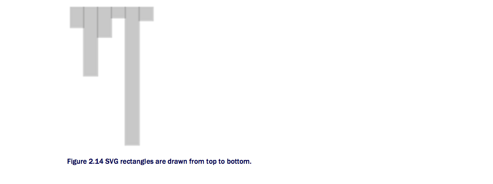

우리는 아래서 막대그래프가 올라가는 형식으로 그려지길 원하기 때문에 문법을 추가해야합니다. 여기서는 약간의 trick이 필요합니다. 현재 가장 긴 막대의 길이가 100인 것을 알고있기 때문에, 100에서 자신의 데이터 값을 뺀 만큼이 자신이 막대를 그리기 시작하는 y 좌표가 되도록 해주면 됩니다. 
~~~javascript
> .attr("y", d => 100-d)
~~~

여기에 더불어서 약간의 색상까지 추가해주고, 테두리 선(stroke)의 굵기 및 색상도 수정해주겠습니다. 그 결과를 **figure 2.15**에서 확인하세요.

~~~javascript
> .attr("height", d=> d)
> .style("fill", "E9922")
> .style("stroke", "#9A8B7A")
> .style("stroke-width", "1px")
> .attr("x", (d,i) => i*10)
> .attr("y", d=> 100 - d);
~~~

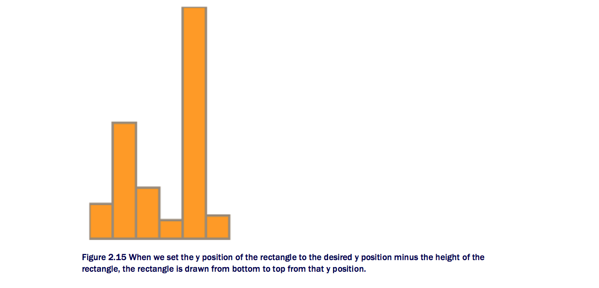

---

### 2.2.3 Integrating scales

위의 예시처럼, array의 value가 바로 사각형의 높이와 연관되어있다면 위와 같은 방식으로도 충분히 그림을 그릴 수 있습니다. 하지만, 그렇치 않은 경우도 있습니다. 아래의 예시를 확인해보시죠.

~~~javascript
> .selectAll("rect")
> .data([14, 68, 24500, 430, 19, 1000, 5555])
> .enter()
> .append("rect")
> .attr("y", d=>24500-d)
~~~

위 코드를 실행한 결과는 책에서 보여주고 있지 않지만, 크기의 편차가 심하기 때문에 24500만 제대로 보이고 14는 보이지 않을 것이라는 사실을 예측할 수 있습니다. 따라서 우리는 앞서 배운 scaling을 사용해야합니다. 이 예시에서는 선형 scaling인 **d3.scaleLinear()**을 사용하기로합니다. scaling에서는 크게 두 개의 method를 받습니다. **.domain()**과 **.range()**이다. 각각의 메소드 안에는 같은 길이의 array가 들어갑니다. 도메인에 있는 array 값이 range의 array에 대응되어서 원래 데이터의 범위(domain)을 바뀐 데이터의 범위(range)로 변환해줍니다.

~~~javascript
> var yScale = d3.scaleLinear().domain([0,24500]).range([0,100])
> yScale(0);  // returns 0
> yscale(100);  // returns 0.408163
> ySclae(24000);  // returns 97.959183
~~~

위에서처럼 새로운 scaling이 가능케하는 변수 yScale을 이용하면 scaling이 된 y좌표와 rectangle의 height를 반영한 새로운 막대 그래프를 그릴 수 있습니다.

~~~javascript
> var yScale = d3.scaleLinear().domain([0,24500]).range([0,100])
>
> .attr("width", 10)
>  .attr("height", d => yScale(d))
>  .attr("y", d => 100 - yScale(d))
>  .style("fill", "E9922")
~~~

**figure 2.17**과 달리, 데이터가 좀더 넓은 범위에 걸쳐 퍼져있다면, linear가 아닌 polylinear scaling을 사용할 수도 있습니다. 이것은 domain과 range에서 2개 이상의 data point를 매칭시켜 우리가 원하는 특정 data 값이 특정 scaled 값에 대응되도록 하는 것입니다.

~~~javascript
> var yScale = d3.scaleLinear().domain([0, 100, 1000, 24500,]).range([0,50,75,100]);
~~~

위의 코드를 이용하면 아래의 **figure 2.18**이 나옵니다.

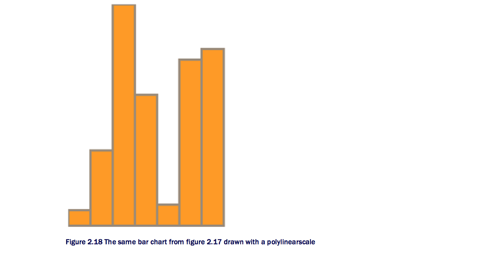

혹은 데이터 값 중 500을 넘는것은 완전히 다 표현할 필요가 없이, 그냥 500을 넘는다는 것만 표현하고 싶을 수도 있습니다. 그럴 땐 아래의 방식으로 사용할 수 있습니다.
~~~javascript
> var ySclae = d3.scaleLinear().domain([0, 100, 500]).range([0, 50, 100])
~~~

위의 코드를 실행하고, y 좌표를 100 - d 로 잡는다면, 아래의 **figure 2.19**가 완성됩니다.

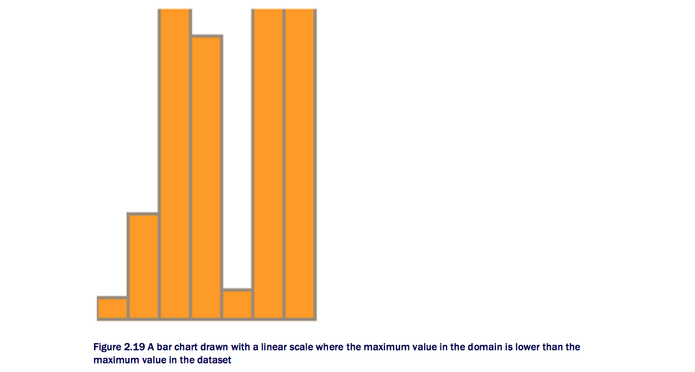

---

## 2.3 Data presentation style, attributes, and content

이제 앞처럼 간단한 예시 데이터에서 머물지 않고, 실제 데이터에 적용해보겠습니다. 이번 절에서는 d3의 기초적인 활용법을 배우게 됩니다.

### 2.3.1 Visualizing from loaded data

cities.csv를 이용한 bar chart를 그리기 위해서는 사실 할 일이 명확합니다. 도시별 인구의 최대값을 찾고 그것을 기준으로 scaling만 하면 됩니다. 따라서 이때는 **d3.max()**를 이용합니다. 아래에서는 그 결과그림을 볼 수 있으며, 각각을 칭하는 용어를 설명합니다.

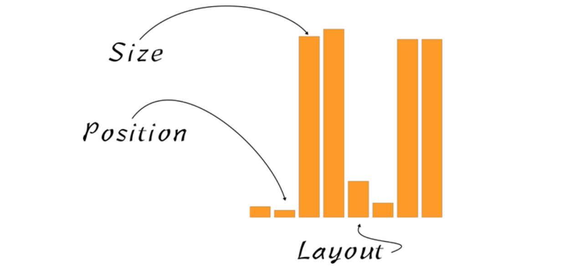

위 그림을 그리는 코드는 다음과 같습니다. 아래 코드에서 우리는 data를 load하고, cast하고, measure 한 뒤 bar chart로 display 합니다.
~~~javascript
d3.csv("cities.csv",(error, data) => {dataViz(data)}); 
function dataViz(incomingData) {
  var maxPopulation = d3.max(incomingData, d => parseInt(d.population))  // population을 integer로 변환
  var yScale = d3.scaleLinear().domain([0,maxPopulation]).range([0,460]); 
  d3.select("svg").attr("style","height: 480px; width: 600px;"); 
  d3.select("svg")
    .selectAll("rect")
    .data(incomingData)
    .enter()
    .append("rect")
    .attr("width", 50)
    .attr("height", d => yScale(parseInt(d.population))) .attr("x", (d,i) => i * 60)
    }
    .attr("y", d =>480 - yScale(parseInt(d.population))) .style("fill", "#E9922")
    .style("stroke", "#9A8B7A")
    .style("stroke-width", "1px")
}
~~~

---

tweeter 데이터는 좀 더 복잡합니다. 앞서 트위터 데이터의 구조에 대해 설명하였지만, 지금 우리가 그리고자 하는 개인별로 트윗을 얼마나 많이 남겼는가는 데이터를 약간 변형해야 합니다. 따라서 우리는 **d3.nest()**를 이용하여 개인별로 작성한 트윗을 모은 뒤, length를 이용하여 각자 남긴 트윗의 갯수를 셀 것입니다. 

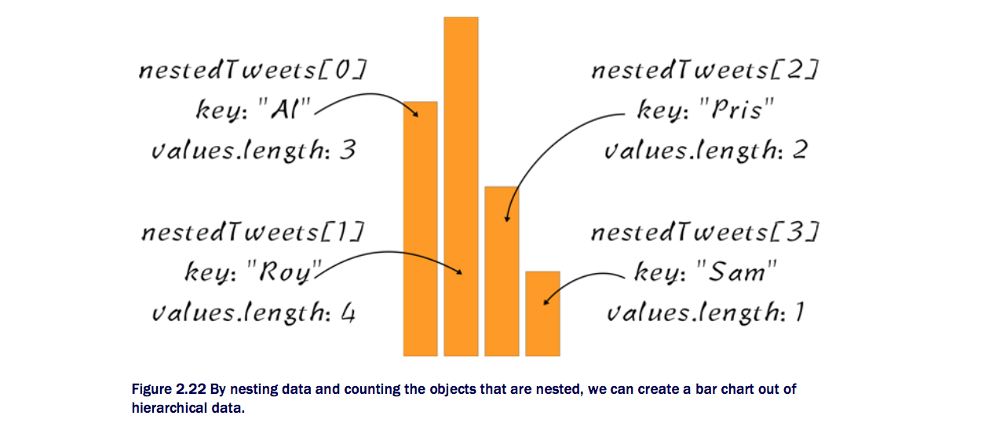

~~~javascript
d3.json("tweets.json",(error, data) =>{dataViz(data.tweets)});  //json 형식이므로 data.tweets 안에 우리가 진짜 원하는 데이터가 있음
function dataViz(incomingData) {
var nestedTweets = d3.nest()
.key(d => d.user)
.entries(incomingData);  //user별로 nested 형태로 데이터를 바꾸어 nestedTweets에 저장하고
nestedTweets.forEach(d => {
d.numTweets = d.values.length;  
})                       //nestedTweets 안에 numTweets라는 key를 만들어 그 안에 각 user별 트윗 횟수를 저장
var maxTweets = d3.max(nestedTweets, d =>d.numTweets);
var yScale = d3.scaleLinear().domain([0,maxTweets]).range([0,500]); 
d3.select("svg")
.selectAll("rect")
.data(nestedTweets)
.enter()
.append("rect")
.attr("width", 50)
.attr("height", d => yScale(d.numTweets)) 
.attr("x", (d,i) => i * 60)    // 막대 사이에 10px씩 빈칸 만듦
.attr("y", d => 500 - yScale(d.numTweets)) 
.style("fill", "#FE9922")
.style("stroke", "#9A8B7A") 
.style("stroke-width", "1px");
}
~~~

---

### 2.3.2 Setting Channels

단순한 양적 데이터라면 위에서처럼 막대 그래프만으로 충분히 시각화가 가능합니다. 하지만 우리는 종종 **multivariate** 데이터를 마주하게 됩니다. **Multivariate** 데이터는 쉽게 말해 하나의 데이터 포인트에 담긴 정보가 여러개라는 의미입니다. column이 여러개라고 보셔도 무방합니다. 우리는 이러한 데이터를 쉽게 나타내기 위해 channel이라는 것을 이용합니다. channel은 쉽게 말해 시각적으로 데이터를 보여질 수 있게 만드는 다양한 방법들입니다.

- channel이란?
    - 데이터를 표현하고자 할 때는 각 데이터에 맞는 가장 적절한 표현방법이 있습니다. 이 모든 표현 방법을 channel이라고 총칭합니다.
    - 예를 들어, height, width, area, color, position, shape, hue, saturation, etc.
    - 채널을 사용할 때에는 몇 가지 주의할 점이 있습니다.
        - 너무 많은 채널을 사용하지 마세요. 채널의 갯수보단, 얼마나 데이터에 적합한 채널을 사용했는지가 중요합니다.
        - 독자의 입장에서 생각하세요. 
            - 예를 들어, 사람은 길이보단 면적을 더 주요하게 인식합니다. 

위의 사실을 인지하고 tweets.json 으로 돌아가보죠. 우리는 개인별 트윗 횟수도 궁금하지만 다른 많은 얻을 것들이 있습니다. 예를 들어 좋아요 및 retweet 여부를 통해 각 트윗의 영향력을 알아보고 싶다고 생각해보죠. 이제 단순히 index를 기준으로 x축에 배치하지 않고, tweet이 발생한 시간을 x축, 트윗의 영향력의 정도를 y축에 놓아보겠습니다.

~~~javascript
function dataViz(incomingData) {
incomingData.forEach(d => {
d.impact = d.favorites.length + d.retweets.length;   // 영향력 나타내는 impact 추가
d.tweetTime = new Date(d.timestamp);                 // date datatype으로 변환
})
var maxImpact = d3.max(incomingData, d =>d.impact);
var startEnd = d3.extent(incomingData, d => d.tweetTime);   // 가장 이르고 빠른 시간 return => x축의 구간 설정 가능
var timeRamp = d3.scaleTime().domain(startEnd).range([20,480]); 
var yScale = d3.scaleLinear().domain([0,maxImpact]).range([0,460]);
var radiusScale = d3.scaleLinear()
.domain([0,maxImpact]).range([1,20]); 
var colorScale = d3.scaleLinear()
.domain([0,maxImpact]).range(["white","#75739F"]);  // 색상에 대해 scaling 적용. impact 강할수록 흰 -> 빨
d3.select("svg")
.selectAll("circle")
.data(incomingData)
.enter()
.append("circle")
.attr("r", d =>radiusScale(d.impact))              // 원의 크기 역시 영향력에 의해 바뀌도록
.attr("cx", d =>timeRamp(d.tweetTime))
.attr("cy", d =>480 - yScale(d.impact)) 
.style("fill", d =>colorScale(d.impact)) 
.style("stroke", "black") 
.style("stroke-width", "1px");
};
~~~

---

### 2.3.3 Enter, update, merge and exit

앞서 **.enter()**와 **.exit()** 모두 data value와 select된 DOM element 간의 갯수가 맞지 않는 경우에 대응 시켜주기 위하여 사용된다고 배웠습니다. enter는 data value가 더 많을 때 사용하며, exit은 DOM element가 더 많을 때 사용합니다. 아래 그림이 이를 쉽게 설명해줍니다.

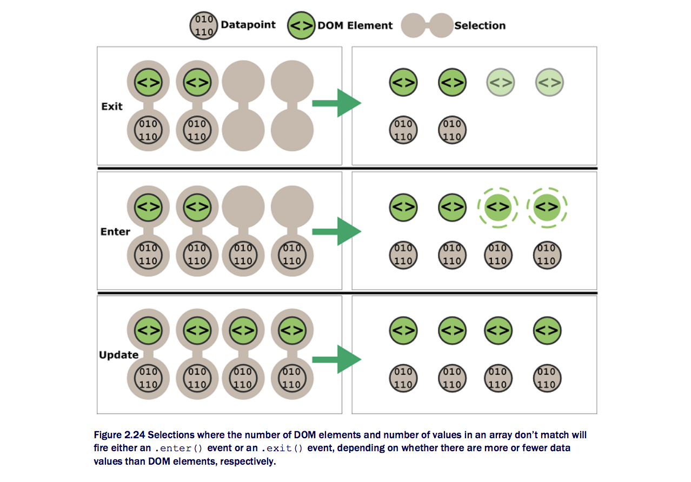

**.enter()**와 **.exit()**은 child element에 대하여 행해지는 action을 포합할 수 있습니다. 예를 들어 앞의 예시들에서는 **.enter()** 뒤에 **.append()**를 붙여서 새로운 element를 추가하였죠. 또한 이처럼 추가된 element가 다른 element 안에 들어갈 수 있다면 그 및에 child element로 넣을 수도 있습니다. SVG element의 경우에는 **'svg', "g", "text"** element만 child element를 가질 수 있지만, 전통적인 DOM에서는 일반적인 DOM 문법이 허용하는 모든 element 추가가 가능합니다.

